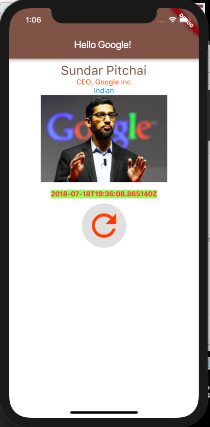

A Easy Sample Flutter application.

I have gone through the following links to build this sample application.
Please use this reference for better understanding

[Flutter Widgets](https://flutter.io/widgets-intro/) is used to understand the Flutter's widgets.

[Layout Widgets](https://flutter.io/widgets/layout/) is used to understand the Flutter's layouts.

[Flutter UI inspector](https://flutter.io/inspector/) is used to analyse the designed screen.

[Debugging Flutter Apps](https://flutter.io/debugging/#visual-debugging) is used to understand debugging process.

[Building Layouts in Flutter](https://flutter.io/tutorials/layout/#step-3) - building a simple UI and inspect it

# Android and iOS Output:

 
 

## Getting Started Officially

For help getting started with Flutter, view our online
[documentation](https://flutter.io/).

